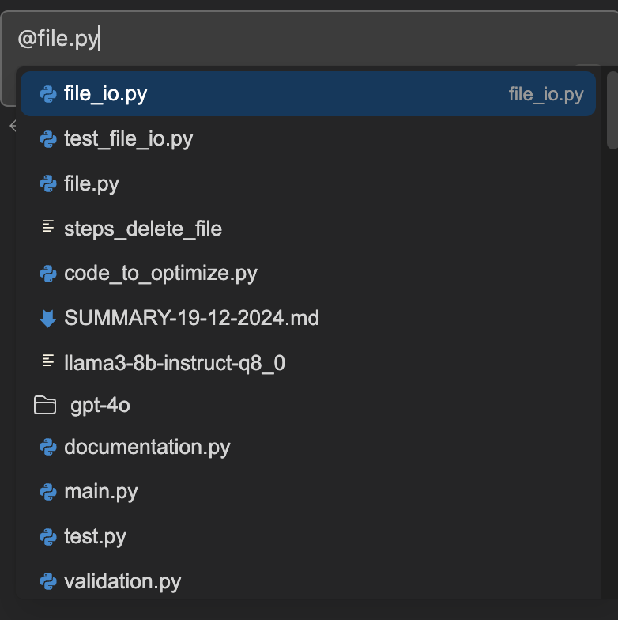

# Prompt Automation

This project automates interactions with the continue.dev extension on VS-Code and processes output logs to generate usable outputs. It involves running models, fetching logs, and generating JSON output based on these logs.

## Overview

The project consists of several scripts that work together to facilitate automation of running prompts on Visual Studio Code. It uses the `pyautogui` library for GUI automation tasks and relies on logging and subprocess management for interacting with the `ollama` server.

## Running the Application

1. **Prerequisites**: To run the script, we need to ensure that following items are completed:
    - Ensure that ollama (0.3.14) and continue.dev (1.0.1) is installed.
    - Clone the repository and provide necessary permissions to the files.
    - Ensure any dependencies required by the scripts (`pyautogui`, `psutil`, `glob`, etc.) are installed (from requirements.txt).
    - We need to setup the prompts list in these files: prompts_file.txt and context_providers.txt. Although, we can set it up in any number of files (1..n), and if you are running the prompts in same context, then it is recommended to use only one prompt file.
    - Edit the prompt file and set up the prompts in such a way that they should not be conflicting with others. If the prompt in the text file is short, then it might conflict with any other automated task of continue.dev. This is to be done for any "@" (context providers/file/codebase, etc.) to be referenced by the prompt.
    

    As you can see in the above image, we needed to reference "file.py", but even after entering the exact name, continue.dev highlights "file_io.py" first. So, in the automation process, wrong file will be selected.
    - To ensure this does not happen, we need to use definite and specific names of the references instead of generic ones.
    - Once the files are set, we can go on to executing the scripts.

2. **Executing Scripts**:
    - Navigate to the main folder of the project. Ensure you are in the Granite-manual-test-cases directory.
    - Execute the command `python3 prompt_automation/guirunner.py` script as the main entry point to start the automation process. It will handle interactions based on the model and input files you choose.
    - Click on the chat box in the continue.dev extension and do not interact with any other area through the mouse, till the process is completed.
    - The timing of Granite models is fetched automatically from Ollama. However, for API based models like Claude and GPT, we need to set the timing for each prompt beforehand manually. We need to set the value of variable "sleep_time" in guirunner.py such that each prompt could be completed in that many seconds. Usually, 60-80 seconds is enough threshold.
3. **JSON Output**: After execution, JSON files containing processed prompts and timings are generated in the specified directory.

## Files and Their Descriptions

### `fetch_model_name.py`
This script is responsible for fetching the model name using the `ollama` command-line interface. It tries to retrieve and return the name of a running model within a timeout period:
- **Functionality**: Runs `ollama ps` to list models and fetches the name from the result.

### `guirunner.py`
This script provides automation for GUI operations such as sending input to `Continue.dev`. It waits for server logs to update, processes input files, and initiates model interactions:
- **Functions**:
  - `wait_for_log_update`: Waits for the appearance of a specific keyword in the server logs.
  - `automate_continue_dev`: Automates input typing in `Continue.dev` and handles server logs.
  - `process_input_file`: Opens and processes each line from an input text file, feeding it to Continue.dev.

### `m2j.py`
Handles JSON output creation from the logs:
- **Functionality**: Parses markdown logs and generates JSON files. Maintains timing information for each entry and stores resultant JSON files in structured directories.
- **Current Format of Logs**: 
    {
    "0": [
    {
      "name": "MODEL-NAME",
      "date": "DATE-OF-RUN",
      "file_name": "MODEL-NAME_DATE-OF-RUN.json",
      "total_time": "TOTAL TIME OF ALL THE PROMPTS",
      "prompt": [
        {
          "user": "prompt1",
          "assistant": "result1",
          "time": "Time of prompt1"
        },
        {
          "user": "prompt2",
          "assistant": "result2",
          "time": "Time of prompt2"
        }
      ]
    }
  ]
}
}

### `ollama_server.py`
Manages the `ollama` server processes:
- **Functionality**: Initializes and starts/stops the server process, logs the server's output, and provides utility methods to query log content.

### Key Dependencies
- **Python Libraries**: `subprocess`, `pyautogui`, `psutil`, `time`, `re`, `os`, `glob`, `json`.
- **Tools**: `ollama` command-line interface for interacting with models.

## Troubleshooting

- **Model Not Detected**: If the `fetch_model_name.py` raises a `RuntimeError`, ensure your models are running and that `ollama` is properly configured.
- **Server Logs**: Check the `logs` directory for server log output and error reporting.

## Contributing

Contributions to enhance the automation or add features are welcome. Please ensure any proposed changes are tested thoroughly.
